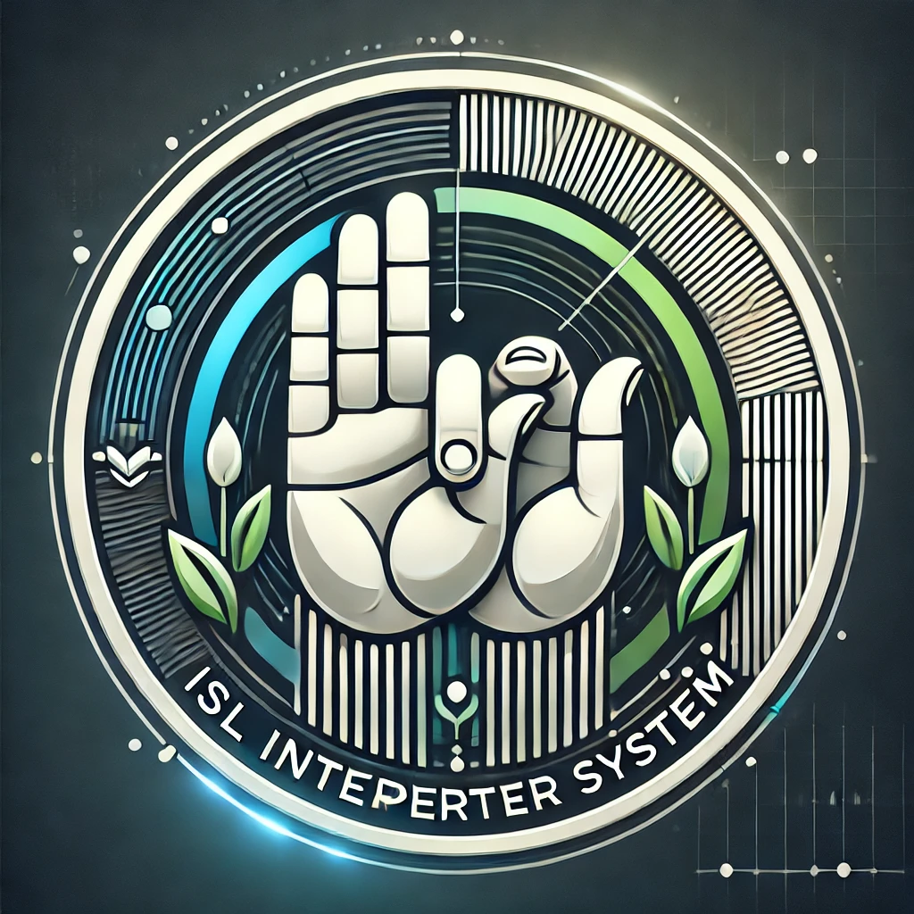
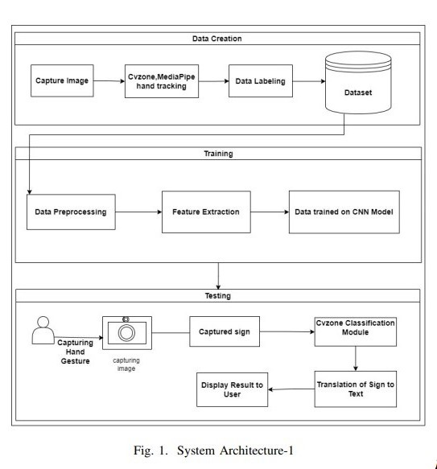
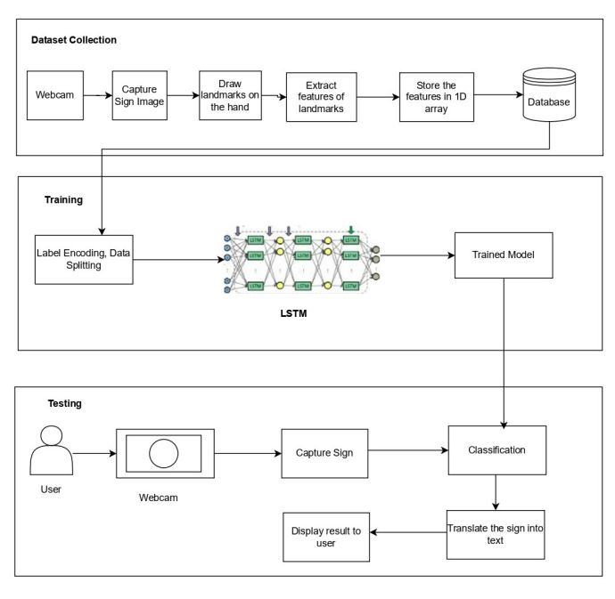

# ISL Interpreter System

The **Indian Sign Language (ISL) Interpreter System** bridges the communication gap between the hearing-impaired and non-signing individuals. Utilizing curated datasets and advanced models like CNN and LSTM, the system translates short sign words into text in real-time. This tool addresses challenges in emergency communication and promotes inclusivity and accessibility.

---

## 🎯 Objectives

- **Curated Dataset Creation**: Develop a dataset of **Indian Sign Language (ISL)** gestures, forming the foundation for accurate gesture recognition.
- **Real-Time Translation**: Build a system capable of translating **short sign words into text** in real-time, enabling smooth communication.
- **Bridging Communication Gap**: Facilitate seamless interaction between **deaf** individuals and **non-signing** individuals, fostering inclusivity in everyday conversations.

---

## 🚀 Features

### 1. **Hand Gesture Recognition**
- Leverages **advanced neural networks** to detect and interpret hand gestures in **real-time**.
- Converts hand movements and positions into **text**, enabling seamless communication for the hearing-impaired community.

### 2. **Curated Dataset**
- A specialized dataset of **Indian Sign Language (ISL)** gestures is used to train the system.
- The dataset ensures **high-quality data representation**, improving recognition accuracy and system reliability.

### 3. **Advanced Neural Models**
- **Convolutional Neural Networks (CNN):** Extract spatial features from gesture images to recognize patterns and structures necessary for classification.
- **Long Short-Term Memory Networks (LSTM):** Handle temporal dependencies, making the system robust to sequence-related variations in gestures.
- **cvzone Hand Tracking Module:** Detects and tracks hands in **real-time**, enhancing live use performance.

### 4. **Real-Time Translation**
- **Instant gesture-to-text conversion** allows fast communication in real-time.
- Designed for use in conversations, ensuring **low-latency** response and effective dialogue flow.

### 5. **Emergency Scenarios Support**
- Trained to recognize ISL gestures used in **emergency situations**, ensuring effective communication when time is critical.

### 6. **Scalability**
- **Future-ready design** allowing for:
  - **Translation of small phrases or full sentences**.
  - **Integration with educational platforms** to assist deaf students.
  - Expansion into domains like **public services** and **healthcare**.

### 7. **Inclusive Design**
- A **user-friendly interface** that makes it easy for both hearing and hearing-impaired users to interact.
- Promotes accessibility, inclusivity, and independence for the hearing-impaired community.

---

## 📊 Algorithm Performance

The system uses **both CNN and LSTM models** for training and testing. Below is a comparative table showcasing the performance metrics of these algorithms:

| **Metric**   | **CNN Model** | **LSTM Model** |
|--------------|---------------|----------------|
| **Accuracy** | 0.961         | 0.958          |
| **Precision**| 0.963         | 0.951          |
| **Recall**   | 0.951         | 0.947          |
| **F1 Score** | 0.956         | 0.949          |

### Key Observations:
- The **CNN model** is slightly better in terms of accuracy and precision, making it ideal for static gesture recognition.
- The **LSTM model** effectively handles **temporal dependencies**, making it more suitable for dynamic gestures and sequences.

---
## 🏗️ Architecture

<div style="display: flex; justify-content: space-around; align-items: center;">
  
  
</div>


The system architecture combines **CNN for feature extraction** and **LSTM for sequence modeling** to deliver a robust real-time gesture recognition solution.

---

## 💻 Technologies Used

### 1. **Programming Languages**
- **Python**: Primary language used for **model development**, **data preprocessing**, and **algorithm implementation**.

### 2. **Machine Learning Frameworks**
- **TensorFlow/Keras**: Used for **building and training CNN and LSTM models**, enabling effective gesture recognition.
- **PyTorch**: Alternative framework for **neural network experimentation**.

### 3. **Computer Vision Libraries**
- **OpenCV**: Used for **image processing**, including gesture detection, resizing, and augmentation.
- **cvzone**: High-level library used for **real-time hand tracking** and **gesture detection**.

### 4. **Dataset Tools**
- **Pandas and NumPy**: For **data management** and preprocessing, ensuring compatibility for training.
- **Matplotlib and Seaborn**: Used for **visualizing data** and evaluating model performance.

### 5. **Model Optimization Techniques**
- **Transfer Learning**: Utilizes **pre-trained CNN models** to **boost model accuracy** and **reduce training time**.

### 6. **Deployment Tools**
- **Gradio**: For building **interactive real-time interfaces**.

### 7. **Development Environment**
- **Pycharm**: For **exploratory development** and **model experimentation**.

### 8. **Version Control**
- **Git and GitHub**: For **version control**, **collaborative development**, and **repository management**.

---

## 🚀 Future Scope

1. **Enhanced Gesture Recognition**:
   - Expanding the dataset to include a wider range of ISL gestures, covering more words and phrases for better communication.
   - Utilizing **3D hand gesture recognition** to improve accuracy and handle complex gestures more effectively.

2. **Integration with Augmented Reality (AR)**:
   - Exploring the use of **AR** to provide real-time visual translations of sign language gestures, offering an interactive experience.

3. **Multilingual Translation**:
   - Incorporating **multi-language support**, enabling the system to translate gestures into different languages (e.g., English, Hindi) and vice versa.

4. **Mobile Application**:
   - Developing a mobile app to make the system more accessible and portable for everyday use.

5. **Advanced AI Models**:
   - Implementing **transformer-based architectures** to handle more complex phrases and improve real-time translation efficiency.

6. **Public Service Deployment**:
   - Deploying the system in hospitals, airports, and government offices to facilitate communication for the hearing-impaired in real-world scenarios.

---

## 🏆 Achievements

- **IEEE Paper Publication**:  
   The **Indian Sign Language (ISL) Interpreter System** has been featured in an **IEEE paper**, contributing to the academic community in the field of gesture recognition.  
   🎓 [Read the IEEE Paper here](https://ieeexplore.ieee.org/document/10575064)

- **Licensed Dataset**:  
   The **SignVaria Dataset** used in the ISL Interpreter System has been licensed and made publicly available on Kaggle.  
   📊 [Explore and Download the Dataset here](https://www.kaggle.com/datasets/sohamvaidya1627/sign-varia)
  
- **Copyright**:  
   The ISL Interpreter System is a copyrighted project, with all rights reserved.  
   📜 [View the Copyright details here](https://drive.google.com/file/d/1VsKFun6yfF6oJNPksZuZr-tt3JnRG22O/view)
---

## 🚀 Getting Started

Follow these steps to run the ISL Interpreter System:

1. **Clone the repository**:
   ```bash
   git clone https://github.com/yourusername/ISL-Interpreter-System.git


 
