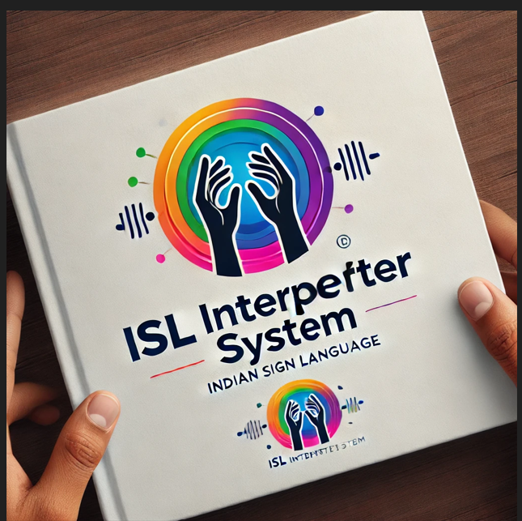

# ISL-Interpretation-system
The Indian Sign Language (ISL) Interpreter System bridges the communication gap between the hearing-impaired and non-signing individuals. It utilizes curated datasets and advanced models, including CNN, and object detection with cvzone, to translate short sign words into text in real time. This system addresses challenges in emergency communication and promotes accessibility.

## Features

### 1. Hand Gesture Recognition
The system leverages cutting-edge neural networks to detect and interpret hand gestures in real-time. By analyzing movements and positions of the hands, it accurately translates them into meaningful text, ensuring smooth communication for the hearing-impaired community.

### 2. Curated Dataset
A meticulously crafted dataset of Indian Sign Language (ISL) gestures forms the backbone of the system. Each gesture is represented in multiple formats, providing diverse and high-quality training data to improve recognition accuracy and system reliability.

### 3. Advanced Neural Models
To achieve precise and efficient gesture recognition, the system integrates multiple state-of-the-art models:
- **Convolutional Neural Networks (CNN):** Extract spatial features from gesture images, identifying patterns and structures crucial for classification.
- **cvzone Hand Tracking Module:** Enables real-time hand detection and tracking, ensuring smooth operation during live use.

### 4. Real-Time Translation
The system processes input gestures on-the-fly and converts them into corresponding text representations instantly. This ensures reduced response times and facilitates seamless communication, even during fast-paced conversations.

### 5. Emergency Scenarios Support
Recognizing the importance of accessibility during critical situations, the system is specifically trained to recognize and translate ISL gestures commonly used in emergencies. This feature ensures effective communication in high-stakes scenarios.

### 6. Scalability
The design is future-ready, with the potential for expansion. Planned enhancements include:
- Translation of small phrases or complete sentences in ISL.  
- Integration into educational platforms to assist deaf students in understanding course materials.  
- Broadening its application across various domains, such as public services and healthcare.

### 7. Inclusive Design
The system’s user-friendly approach bridges the gap between the deaf and hearing communities, making it an essential tool for promoting accessibility, inclusivity, and independence for hearing-impaired individuals.

 
